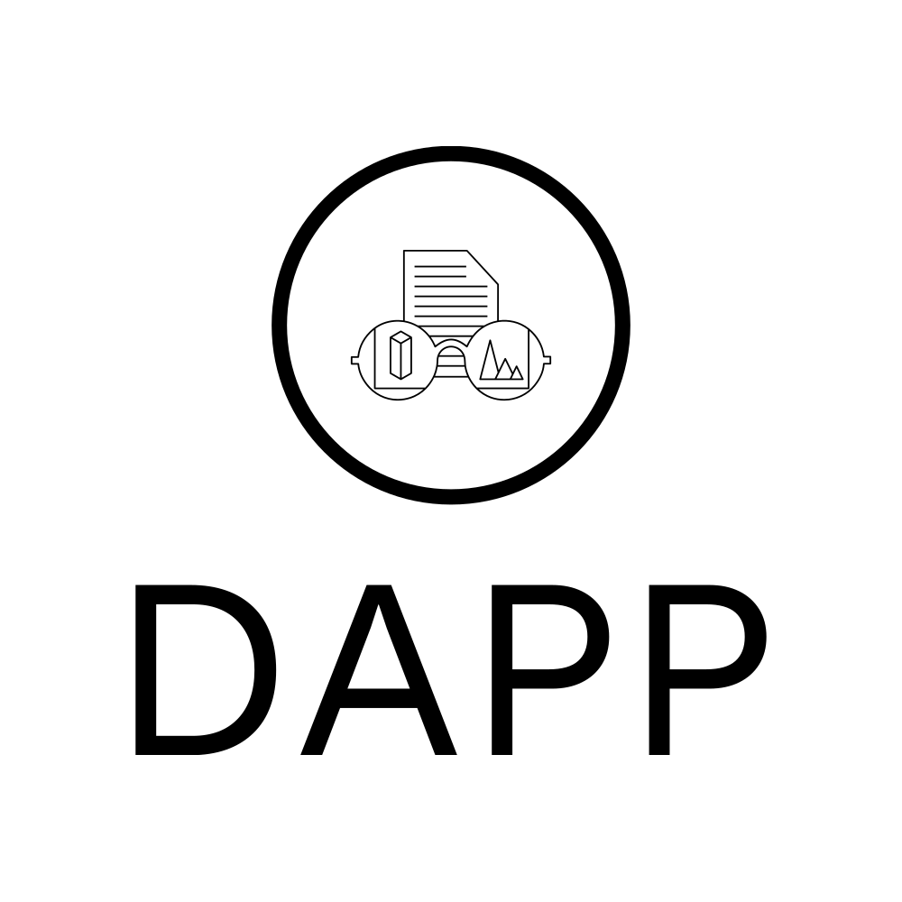

# Decentralized Community Proposal Management DApp

## Table of Contents
- [Introduction](#introduction)
- [Features](#features)
- [Getting Started](#getting-started)
  - [Prerequisites](#prerequisites)
  - [Installation](#installation)
- [Usage](#usage)
- [Smart Contracts](#smart-contracts)
- [Contributing](#contributing)
- [License](#license)

## Introduction

Welcome to the Decentralized Community Proposal Management DApp! This decentralized application (DApp) is built on the Ethereum blockchain to help communities manage and vote on proposals in a transparent and secure manner. Whether you're part of a homeowners association, an open-source project, or any group that makes decisions through proposals, this DApp simplifies the process.

## Features

- **User-Friendly Interface**: An intuitive and user-friendly interface for creating, viewing, and voting on proposals.
- **Decentralized**: Built on the Ethereum blockchain, ensuring transparency and security.
- **Proposal Creation**: Easily create proposals with all the necessary details, such as title, description, and voting options.
- **Voting**: Members of the community can vote on proposals using their Ethereum wallets.
- **Proposal Management**: Proposals can be managed by their creators, allowing for edits and withdrawals.
- **Smart Contracts**: Utilizes Ethereum smart contracts for proposal creation, voting, and management.
- **Token Integration**: Supports custom tokens or native Ether for voting.
- **History and Archive**: Maintains a history of all proposals and allows archiving of completed proposals.
- **Community Governance**: Empowers the community to make decisions collectively.

## Getting Started

Follow these instructions to get the DApp up and running on your local development environment.

### Prerequisites

- [Node.js](https://nodejs.org/) installed (recommended version: LTS)
- [npm](https://www.npmjs.com/) or [yarn](https://yarnpkg.com/) package manager
- [Hardhat](https://hardhat.org/hardhat-runner/docs/getting-started) smart contract development
- [MetaMask](https://metamask.io/) or another Ethereum wallet extension for your browser

